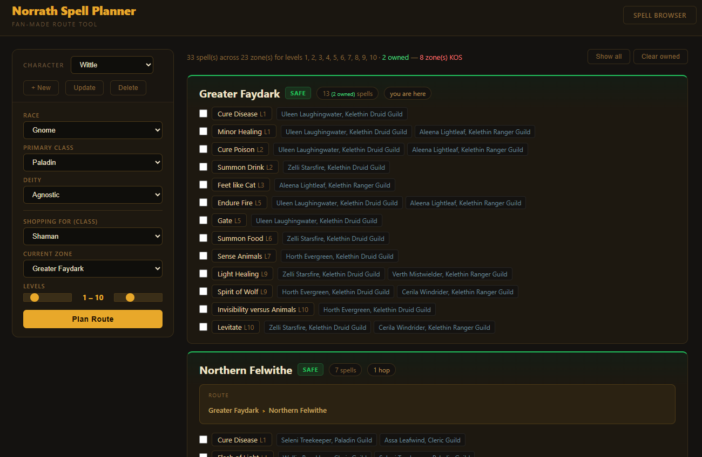

# EQ Spell Planner

Faction-aware spell shopping route planner for EverQuest. Given your race, primary class, deity, current zone, and desired spell levels, ranks destinations by spells available vs. travel distance — filtering out zones where you'd be killed on sight or refused service.



## Usage

Requires [Bun](https://bun.sh/) >= 1.0.

```bash
bun install
bun run dev        # → http://localhost:4321
bun run typecheck  # TypeScript validation
```

## How it works

Spell, NPC, and zone data lives in a single graph (`data/graph.json`). The planner:

1. Finds spells matching your selected class and level range
2. Traces which NPCs sell those spells and which zones those NPCs are in
3. Computes hop distance from your current zone via BFS over zone adjacency edges
4. Resolves faction standing from three dimensions (race, primary class, deity) — takes the worst
5. Ranks zones by `spells_available / hops`, with KOS and won't-sell zones sorted to the bottom

## Faction model

| Standing | Meaning | Cause |
|----------|---------|-------|
| `safe` | Welcome | Good race/class/deity alignment |
| `neutral` | No issues | Outdoor zones, neutral combos |
| `wont_sell` | Merchants refuse | Evil class or deity in a good city (or vice versa) |
| `kos` | Guards attack | Wrong race for that city |

"Primary Class" and "Shopping For" are separate inputs because secondary/tertiary classes don't carry faction penalties in EQ — only your primary identity matters for access.

## Data

All 12 classes, 1,064 spells, 73 zones (47 with vendors), full bidirectional zone connectivity, boat crossings flagged. Most spells also carry description/mana/cast-time/etc. detail (see `DECISIONS.md`).

**Updating the graph:** `data/graph.json` is never hand-edited or regenerated wholesale. Changes go through a numbered, run-once migration in `migrations/` (e.g. `bun run migrations/012-normalize-skill-names.ts`) that reads the current file, transforms it, and writes it back — see any existing migration for the pattern. `src/graph.ts` is the only code allowed to read/write it outside of migrations.

If this app is deployed as a Lambda (see "Deploying" below), **the deployment has its own bundled snapshot of `data/graph.json` — it does not read live from this repo.** Running a migration locally changes nothing for a live deployment until that deployment is rebuilt and redeployed.

## API (read-only, shared between local dev and any Lambda deployment)

The `levelMin`/`levelMax` params take a range; `class`/`spells`/`zones` take comma-separated lists.

| Endpoint | Purpose |
|----------|---------|
| `GET /api/plan?class=shaman,druid&levelMin=5&levelMax=7&from=Halas&race=barbarian&primaryClass=shaman&deity=the+tribunal` | Ranked zone recommendations |
| `GET /api/route?from=Halas&to=Kelethin` | Point-to-point route, boat hops flagged |
| `GET /api/spells?class=shaman&levels=9` | List spells for a class/level |
| `GET /api/spells/search?q=spirit` | Spell name autocomplete |
| `GET /api/spell/:id/vendors` | NPCs and zones selling a spell |
| `GET /api/zones` | All zones |
| `GET /api/classes` | Classes with loaded spell data |
| `GET /api/graph` | Full Cytoscape-format graph |
| `GET /api/stats` | Node/edge counts |

## Mutation endpoints (local dev only — not in the Lambda build)

| Endpoint | Purpose |
|----------|---------|
| `POST /api/spell` | Add a spell |
| `POST /api/npc` | Add an NPC |
| `POST /api/zone` | Add a zone |
| `POST /api/sells` | Link NPC → spell |
| `POST /api/connects` | Link zone ↔ zone |
| `DELETE /api/node/:id` | Remove a node and its edges |

These have no auth and only exist in `src/server.ts` (the local Bun server) — see `DECISIONS.md` for why they're never bundled into the Lambda build.

## Deploying

This repo has no opinion on where or how it's hosted — no hardcoded domain, path prefix, or cloud-provider assumption anywhere in the code. It exposes two ways to run:

- `bun run dev` — the full app (API + static frontend) via Bun, for local use.
- `bun run build:lambda` — packages `src/lambda.ts` (a Lambda handler wrapping the same read-only route table `server.ts` uses) plus `data/graph.json` into `dist-lambda.zip`. Whatever infra deploys this app owns all routing/domain/path/CDN decisions — none of that lives here. `src/lambda.ts` expects to receive request paths already relative to its own root; stripping any external path prefix is the deploying infra's job.

The frontend (`public/*`) doesn't assume it's served from a domain root either — all API calls and inter-page links are relative paths, not `/api/...` absolutes, so the same static files work whether served from `/` or from underneath some path prefix.
